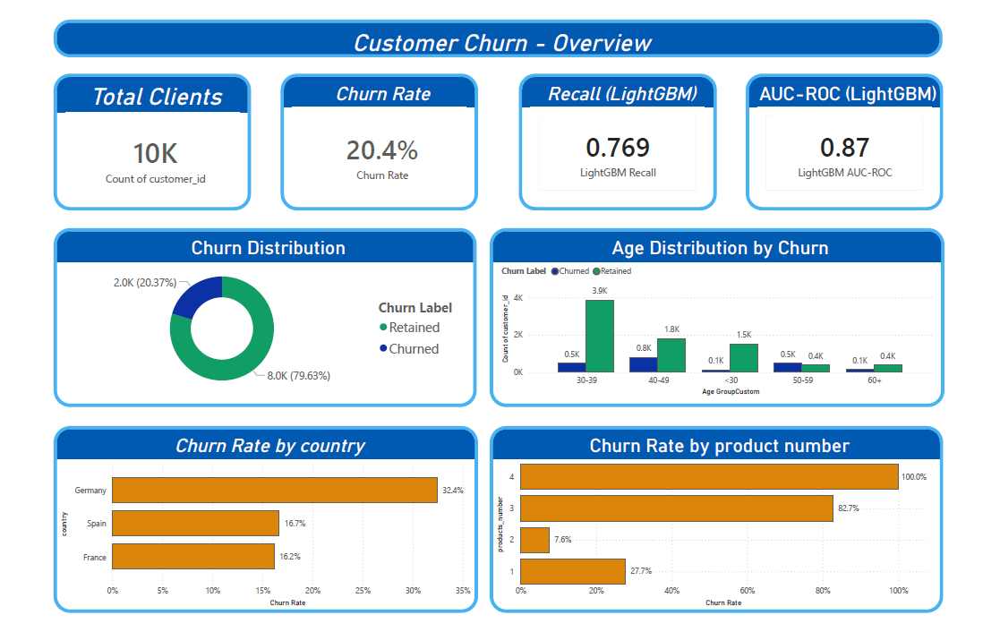

# Bank Customer Churn Prediction

In the banking industry, customer churn is a critical metric — losing a client 
is far more costly than retaining one. This project builds a machine learning 
pipeline to predict which customers are likely to churn based on behavioral and 
demographic features such as activity, age, balance, and tenure. The goal is to 
help banks proactively identify at-risk customers and take action to improve 
retention.

## Overview
- Dataset: Bank Customer Churn (Kaggle) — 10,000 customers, 12 features
- Goal: Predict which customers are likely to churn
- Best model: LightGBM — AUC-ROC 0.87

## Project Structure
'''
churn-prediction/
├── data/
│   ├── raw/
│   └── processed/
├── notebooks/
│   ├── 01_eda.ipynb
│   ├── 02_processing.ipynb
│   └── 03_modeling.ipynb
├── results/
└── README.md
'''
## Notebooks
| Notebook | Description |
|----------|-------------|
| 01_eda | Exploratory analysis, distributions, correlations |
| 02_processing | Cleaning, encoding, feature engineering |
| 03_modeling | Training 8 models, tuning top 3, evaluation |

## Results
| Model | AUC-ROC | Recall | F1 |
|-------|---------|--------|----|
| LightGBM | 0.87 | 0.77 | 0.62 |
| Random Forest | 0.87 | 0.69 | 0.64 |
| SVM | 0.86 | 0.78 | 0.59 |

## Dashboard

## Tech Stack
Python, Pandas, Scikit-learn, LightGBM, XGBoost, Power BI

## Setup
pip install -r requirements.txt
