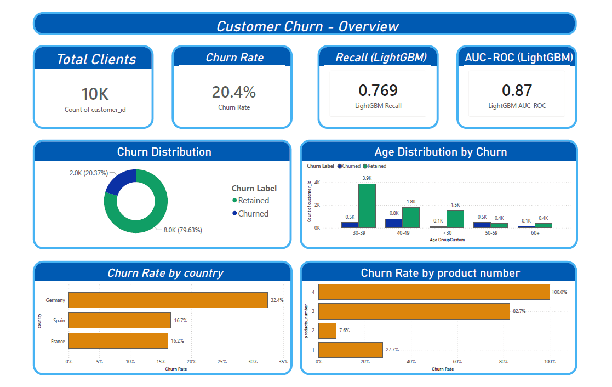

# Bank Customer Churn Prediction

In banking, losing a customer costs far more than keeping one. This project builds a machine learning pipeline that predicts which customers are likely to leave the bank, based on demographic and behavioural features such as age, balance, activity and tenure. The goal is to flag at-risk customers early enough for the bank to act on retention.

## Overview

| | |
|---|---|
| **Dataset** | [Bank Customer Churn](https://www.kaggle.com/datasets/gauravtopre/bank-customer-churn-dataset) (Kaggle): 10,000 customers, 12 columns |
| **Target** | `churn` (1 = customer left the bank, 0 = customer stayed) |
| **Class balance** | 79.6% retained / 20.4% churned |
| **Best model** | Tuned LightGBM: AUC-ROC 0.87, recall 0.77 |
| **Deliverables** | 3 notebooks (EDA, processing, modeling) and a Power BI dashboard |

## Project structure

```
churn-prediction/
├── data/
│   ├── raw/                  # original Kaggle dataset
│   └── processed/            # cleaned and feature-engineered dataset
├── notebooks/
│   ├── 01_eda.ipynb          # exploratory data analysis
│   ├── 02_processing.ipynb   # cleaning, encoding, feature engineering
│   └── 03_modeling.ipynb     # model comparison, tuning, evaluation
├── results/
│   ├── dashboard1.png        # Power BI dashboard
│   └── figures/              # evaluation plots from an earlier experiment
├── models/                   # saved model from an earlier experiment
├── requirements.txt
└── README.md
```

## Pipeline, step by step

### Step 1: Exploratory data analysis (`01_eda.ipynb`)

The notebook downloads the dataset from Kaggle with `kagglehub`, saves a raw copy in `data/raw/`, and explores it.

**1.1 Data overview.** 10,000 rows and 12 columns, with no missing values and no duplicated rows.

| Column | Type | Description |
|---|---|---|
| `customer_id` | int | Unique identifier |
| `credit_score` | int | 350 to 850, mean 651 |
| `country` | text | France, Germany, Spain |
| `gender` | text | Male, Female |
| `age` | int | 18 to 92, mean 39 |
| `tenure` | int | Years with the bank, 0 to 10 |
| `balance` | float | Account balance, 0 to 250,898 |
| `products_number` | int | Number of bank products held, 1 to 4 |
| `credit_card` | 0/1 | Holds a credit card |
| `active_member` | 0/1 | Active member flag |
| `estimated_salary` | float | 12 to 199,992 |
| `churn` | 0/1 | Target |

**1.2 Target distribution.** 7,963 customers stayed (79.63%) and 2,037 churned (20.37%). The classes are imbalanced, which drives the choice of metrics and class weighting in step 3.

**1.3 Categorical features.**

| Feature | Value | Share of customers | Churn rate |
|---|---|---|---|
| Country | France | 50.1% | 16.2% |
| Country | Germany | 25.1% | 32.4% |
| Country | Spain | 24.8% | 16.7% |
| Gender | Male | 54.6% | 16.5% |
| Gender | Female | 45.4% | 25.1% |

Churn rate by country and gender (%):

| | Female | Male |
|---|---|---|
| France | 20.3 | 12.7 |
| Germany | 37.6 | 27.8 |
| Spain | 21.2 | 13.1 |

German customers churn about twice as often as French or Spanish ones, and women churn more than men in every country.

**1.4 Correlation with churn.** No numerical feature is strongly correlated with the target on its own.

| Feature | Correlation with `churn` |
|---|---|
| `age` | 0.285 |
| `balance` | 0.119 |
| `estimated_salary` | 0.012 |
| `credit_card` | -0.007 |
| `tenure` | -0.014 |
| `credit_score` | -0.027 |
| `products_number` | -0.048 |
| `active_member` | -0.156 |

Age is the strongest signal, and inactive members churn more (26.9%) than active ones (14.3%).

**1.5 Outliers (1.5 × IQR rule).** Only three features have flagged values: `age` (359 rows, 3.59%), `products_number` (60 rows, 0.60%) and `credit_score` (15 rows, 0.15%). These are real customers (older clients, customers with 4 products), so they are kept.

**Output of this step:** `data/raw/Bank-Customer-Churn-Prediction.csv`, plus a copy in `results/` used as a Power BI source.

### Step 2: Processing and feature engineering (`02_processing.ipynb`)

**2.1 Cleaning.** `customer_id` is dropped because it carries no predictive information. No rows are removed, since there are no missing values or duplicates.

**2.2 Encoding.** `country` and `gender` are one-hot encoded with the first level dropped, giving `country_Germany`, `country_Spain` and `gender_Male`. The dataset is then fully numeric, with 12 columns.

**2.3 New features**, each motivated by a finding from the EDA:

| Feature | Definition | Reason |
|---|---|---|
| `age_group` | Age binned into ≤30, 31-40, 41-50, 51-60, 60+ (one-hot encoded) | The relation between age and churn is not linear |
| `has_balance` | 1 if balance > 0 | 36% of customers hold a zero balance |
| `tenure_group` | Tenure binned into new (0-2 years), medium (3-5), loyal (6-10) (one-hot encoded) | Separates stages of customer loyalty |
| `active_products` | `active_member` × `products_number` | Interaction between activity and product usage |

**Output of this step:** `data/processed/churn_dataset_clean.csv` with 10,000 rows and 20 columns (19 features and the target):

```
credit_score, age, tenure, balance, products_number, credit_card, active_member,
estimated_salary, churn, country_Germany, country_Spain, gender_Male,
age_group_middle, age_group_senior, age_group_old, age_group_very_old,
has_balance, tenure_group_medium, tenure_group_loyal, active_products
```

### Step 3: Modeling and evaluation (`03_modeling.ipynb`)

**3.1 Train/test split.** Stratified 80/20 split: 8,000 training rows and 2,000 test rows, both with the same churn ratio (20.4%).

**3.2 Scaling.** The five continuous features (`credit_score`, `age`, `tenure`, `balance`, `estimated_salary`) are standardised with a scaler fitted on the training set only. Scaled data is used for Logistic Regression, SGD and SVM. The other models are trained on the unscaled data.

**3.3 Handling class imbalance.** Class weights (`class_weight='balanced'`, or `scale_pos_weight` for XGBoost) are used instead of oversampling. Models are ranked by AUC-ROC rather than accuracy, since a model that predicts "no churn" for everyone would already reach 80% accuracy.

**3.4 Baseline comparison.** Eight classifiers are trained with default settings: Logistic Regression, SGD, Decision Tree, Random Forest, SVM, Naive Bayes, XGBoost and LightGBM.

**3.5 Hyperparameter tuning.** The top three (LightGBM, Random Forest, SVM) are tuned with `RandomizedSearchCV`, using 5-fold cross-validation optimised for AUC-ROC, with 50 random combinations for LightGBM and Random Forest and 30 for SVM.

**3.6 Results on the test set.** The top three rows are the tuned models; the others are baselines.

| Model | Accuracy | Precision | Recall | F1 | AUC-ROC |
|---|---|---|---|---|---|
| **LightGBM (tuned)** | 0.808 | 0.519 | **0.769** | 0.620 | **0.872** |
| Random Forest (tuned) | **0.838** | **0.586** | 0.693 | **0.635** | 0.868 |
| SVM (tuned) | 0.791 | 0.490 | 0.722 | 0.584 | 0.854 |
| XGBoost | 0.824 | 0.559 | 0.639 | 0.596 | 0.826 |
| Logistic Regression | 0.728 | 0.404 | 0.705 | 0.513 | 0.795 |
| SGD | 0.743 | 0.419 | 0.678 | 0.518 | 0.793 |
| Naive Bayes | 0.789 | 0.392 | 0.071 | 0.121 | 0.753 |
| Decision Tree | 0.776 | 0.451 | 0.464 | 0.458 | 0.660 |

LightGBM is selected as the final model. It has the best AUC-ROC and the best recall, and recall matters most here: missing a customer who is about to leave costs more than contacting one who would have stayed.

Confusion matrix of the tuned LightGBM on the 2,000 test customers:

| | Predicted: stays | Predicted: churns |
|---|---|---|
| **Actual: stays** | 1,303 | 290 |
| **Actual: churns** | 94 | 313 |

The model catches 313 of the 407 churners (77%). About half of the customers it flags actually churn (precision 0.52).

**3.7 Feature importance (tuned LightGBM, number of splits).**

| Rank | Feature | Importance |
|---|---|---|
| 1 | `age` | 340 |
| 2 | `balance` | 312 |
| 3 | `estimated_salary` | 248 |
| 4 | `credit_score` | 232 |
| 5 | `products_number` | 148 |
| 6 | `tenure` | 104 |
| 7 | `gender_Male` | 85 |
| 8 | `country_Germany` | 78 |
| 9 | `active_member` | 77 |
| 10 | `active_products` | 73 |

**Output of this step:** three files in `results/`, used by the dashboard: `model_results.csv` (table above), `predictions_lightgbm.csv` (actual label, predicted label and churn probability for each test customer) and `feature_importance.csv`.

### Step 4: Power BI dashboard

The exported CSV files feed a Power BI dashboard that summarises the customer base, the churn drivers and the model performance.



## Key findings

- **Age** is the strongest churn driver: customers aged 50-59 are the only age group where churners outnumber retained customers.
- **Germany** has twice the churn rate of France and Spain (32.4% against about 16%).
- **Number of products**: customers with 2 products churn least (7.6%), while those with 3 or 4 products almost always leave (82.7% and 100%).
- **Inactive members** churn nearly twice as often as active ones (26.9% against 14.3%).
- **Women** churn more than men (25.1% against 16.5%).

## How to run

```bash
git clone <repository-url>
cd churn-prediction

python -m venv venv
venv\Scripts\activate          # Windows
# source venv/bin/activate     # macOS / Linux

pip install -r requirements.txt
pip install notebook
```

Then run the notebooks in order: `01_eda.ipynb`, `02_processing.ipynb`, `03_modeling.ipynb`. Each one reads the files written by the previous one. The hyperparameter search in the third notebook takes a few minutes.

The CSV files in `results/` are generated by the notebooks and are not versioned.

## Tech stack

Python 3.11, Pandas, NumPy, Scikit-learn, LightGBM, XGBoost, Matplotlib, Seaborn, Power BI
